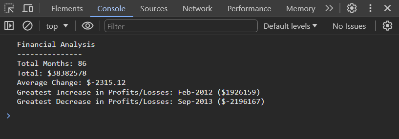

# Console-Finances

## Description

### Code Supplied:

Was provided with a dataset consisting of a 2D array presenting the fields of Date and profit/loss.

### Task:

To write JavaScript code that calculates the following:

- The total number of months included in the dataset.
- The net total amount of Profit/Losses over the entire period.
- The average of the changes in Profit/Losses over the entire period.
- The greatest increase in Profit/Losses (date and difference in the amounts) over the entire period.
- The greatest decrease in Profit/Losses (date and difference in the amounts) over the entire period.

The code intends to store all data in the console. 

## Screenshot

Here is a screenshot showing the output gathered from the console:

## Deployed application

[Link to deployed application](https://adam-deb.github.io/Console-Finances/)

## Installation

N/A

## Credits

N/A